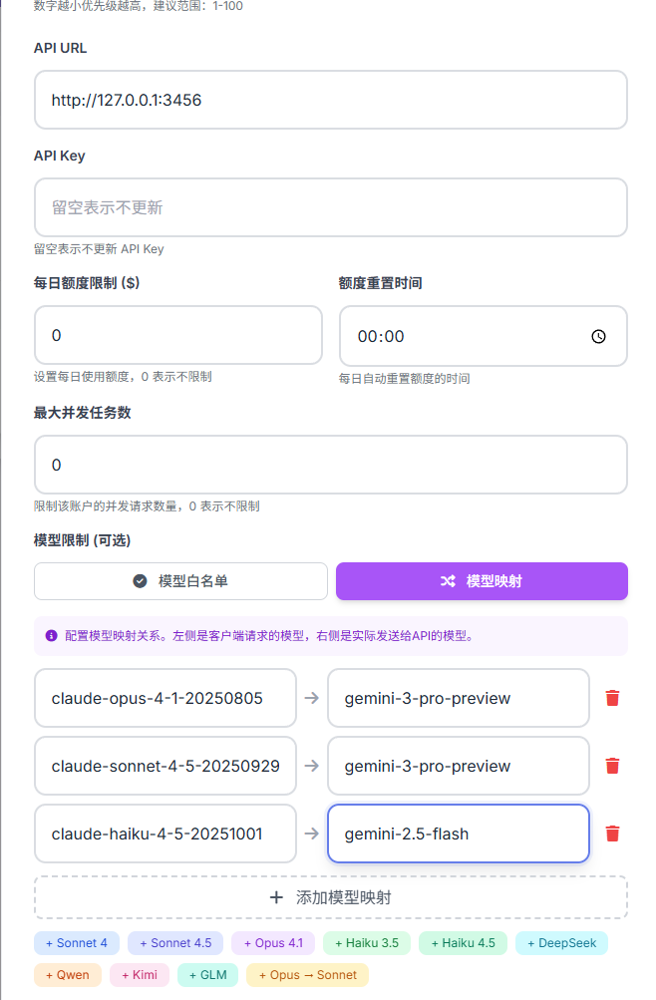

# Claude Code 调用 Gemini 3 模型指南

本文档介绍如何通过 **claude-code-router (CCR)** 在 Claude Code 中调用 Gemini 3 模型，其他模型也可以参照此教程尝试。

---

## 概述

通过 CCR 转换格式，你可以让 Claude Code 客户端无缝使用 Gemini 3 模型。

### 工作原理

```
Claude Code → CCR (模型路由) → CRS (账户调度) → Gemini API
```

---

## 第一步：安装 claude-code-router

安装 CCR：

> **安装位置建议**：
> - 如果只是本地使用，可以只安装到使用 Claude Code 的电脑上
> - 如果需要 CRS 项目接入 CCR，建议安装在与 CRS 同一台服务器上

```bash
npm install -g @musistudio/claude-code-router
```

验证安装：

```bash
ccr -v
```

---

## 第二步：配置 CCR

创建或编辑 CCR 配置文件（通常位于 `~/.claude-code-router/config.json`）：

```json
{
  "APIKEY": "sk-c0e7fed7b-这里随便你自定义",
  "LOG": true,
  "HOST": "127.0.0.1",
  "API_TIMEOUT_MS": 600000,
  "NON_INTERACTIVE_MODE": false,
  "Providers": [
    {
      "name": "gemini",
      "api_base_url": "http://127.0.0.1:3000/gemini/v1beta/models/",
      "api_key": "cr_xxxxxxxxxxxxxxxxxxxxx",
      "models": ["gemini-2.5-flash", "gemini-2.5-pro", "gemini-3-pro-preview"],
      "transformer": {
        "use": ["gemini"]
      }
    }
  ],
  "Router": {
    "default": "gemini",
    "background": "gemini,gemini-3-pro-preview",
    "think": "gemini,gemini-3-pro-preview",
    "longContext": "gemini,gemini-3-pro-preview",
    "longContextThreshold": 60000,
    "webSearch": "gemini,gemini-2.5-flash"
  }
}
```

### 配置说明

| 字段 | 说明 |
|------|------|
| `APIKEY` | CCR 自定义的 API Key，Claude Code 将使用这个 Key 访问 CCR |
| `api_base_url` | CRS 服务的 Gemini API 地址 |
| `api_key` | CRS 后台创建的 API Key（cr_ 开头），用于调度 OAuth、Gemini-API 账号 |

---

## 第三步：在 CRS 中配置 Gemini 账号

确保你的 CRS 服务已添加 Gemini 账号：

1. 登录 CRS 管理界面
2. 进入「Gemini 账户」页面
3. 添加 Gemini OAuth 账号或 API Key 账号
4. 确保账号状态为「活跃」

---

## 第四步：启动 CCR 服务

保存配置后，启动 CCR 服务：

```bash
ccr start
```

查看服务状态：

```bash
ccr status
```

输出示例：

```
API Endpoint: http://127.0.0.1:3456
```

**重要**：每次修改配置后，需要重启 CCR 服务才能生效：

```bash
ccr restart
```

---

## 第五步：配置 Claude Code

现在需要让 Claude Code 连接到 CCR 服务。有两种方式：

### 方式一：本地直接使用

设置环境变量让 Claude Code 直接连接 CCR：

```bash
export ANTHROPIC_BASE_URL="http://127.0.0.1:3456/"
export ANTHROPIC_AUTH_TOKEN="sk-c0e7fed7b-你的自定义Key"
```

然后启动 Claude Code：

```bash
claude
```

### 方式二：通过 CRS 统一管理（推荐）

如果你希望通过 CRS 统一管理所有用户的访问，可以在 CRS 中添加 Claude Console 类型账号来代理 CCR。

#### 1. 在 CRS 添加 Claude Console 账号

登录 CRS 管理界面，添加一个 **Claude Console** 类型的账号：

| 字段 | 值 |
|------|-----|
| 账户名称 | CCR-Gemini3（或自定义名称）|
| 账户类型 | Claude Console |
| API 地址 | `http://127.0.0.1:3456`（CCR 服务地址）|
| API Key | `sk-c0e7fed7b-你的自定义Key`（CCR 配置中的 APIKEY）|

> **注意**：如果 CCR 运行在其他服务器上，请将 `127.0.0.1` 替换为实际的服务器地址，配置文件中需要修改HOST参数为```0.0.0.0```。

#### 2. 配置模型映射

在 CRS 中配置模型映射，将 Claude 模型名映射到 Gemini 模型：

| Claude 模型 | 映射到 Gemini 模型 |
|-------------|-------------------|
| `claude-opus-4-1-20250805` | `gemini-3-pro-preview` |
| `claude-sonnet-4-5-20250929` | `gemini-3-pro-preview` |
| `claude-haiku-4-5-20251001` | `gemini-2.5-flash` |

**配置界面示例：**



> **说明**：
> - Opus 和 Sonnet 映射到性能更强的 `gemini-3-pro-preview`
> - Haiku 映射到响应更快的 `gemini-2.5-flash`

#### 3. 用户使用方式

用户现在可以通过 CRS 统一入口使用 Claude Code：

```bash
export ANTHROPIC_BASE_URL="http://你的CRS服务器:3000/api/"
export ANTHROPIC_AUTH_TOKEN="cr_用户的APIKey"
```

Claude Code 会自动将请求路由到 CCR，再由 CCR 转发到 Gemini API。

---

## 常见问题

### Q: CCR 配置修改后没有生效？

A: 配置修改后必须重启 CCR 服务：

```bash
ccr restart
```

### Q: 连接超时怎么办？

A: 检查以下几点：
1. CRS 服务是否正常运行
2. CCR 配置中的 `api_base_url` 是否正确
3. 防火墙是否允许相应端口
4. 尝试增加 `API_TIMEOUT_MS` 的值

### Q: 模型映射不生效？

A: 确保：
1. CRS 中已正确配置 Claude Console 账号
2. 模型映射配置已保存
3. 重启 CRS 服务使配置生效

### Q: 如何测试连接？

A: 使用 curl 测试 CCR 服务：

```bash
curl -X POST http://127.0.0.1:3456/api/v1/messages \
  -H "Content-Type: application/json" \
  -H "x-api-key: sk-c0e7fed7b-你的自定义Key" \
  -d '{
    "model": "claude-sonnet-4-5-20250929",
    "max_tokens": 100,
    "messages": [{"role": "user", "content": "Hello"}]
  }'
```

---

## 最佳实践

1. **生产环境**：将 CCR 部署在与 CRS 相同的服务器上，减少网络延迟
2. **API Key 管理**：为每个用户创建独立的 CRS API Key，便于使用统计
3. **超时配置**：对于长时间运行的任务，适当增加 `API_TIMEOUT_MS`

---

## 相关资源

- [CCR 官方文档](https://github.com/musistudio/claude-code-router)